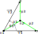

# Lattice homogenization toward Cauchy mechanical continuum

This code computes homogenized Cauchy tensors of beam's lattice. 
The lattice is constituted of an infinite repetition of an elementary cell. The elementary cell is constituted of beams links together. 
It uses Bernoulli's beam model.  
This code is provided freely but if you use it, please refer to "Dos Reis, F., Ganghoffer, J.F., 2012. Equivalent mechanical properties of auxetic lattices from discrete homogenization". Computational Materials Science 51, 314–321. https://doi.org/10.1016/j.commatsci.2011.07.014

after calculations :
MS4 contain compliance tensor in vectorial form [S11, S22, S66, S26, S16, S12]
ME1 contain mechanical moduli : [K, Ex, Ey, nuyx, nuxy, muxy,etaxxy, etayxy, etaxyx, etaxyy]
MatVo : rigidity matrix in Voigt notation
rho contain relative density 

## Table of Contents

- [Lattice homogenization toward Cauchy mechanical continuum](#lattice-homogenization-toward-cauchy-mechanical-continuum)
  - [Table of Contents](#table-of-contents)
  - [Installation](#installation)
  - [Usage](#usage)
    - [Various examples to use the project are furnished, call them in MATLAB :](#various-examples-to-use-the-project-are-furnished-call-them-in-matlab-)
  - [License](#license)
  - [Authors](#authors)
  - [Acknowledgements](#acknowledgements)

## Installation

Instructions to install the project. For example:

```bash
git clone https://github.com/your-username/your-project.git
cd your-project
```

## Usage
The function homogenization can be called with 
```matlab
[ME1,MS4,MATVo,rho]=homogenization(Tb,L1,L2,Y1,Y2,nbeams,nnodes,nodes,Ob,Eb,delta1,delta2,Elast)
``` 

where the parameters are 
```matlab
    %% inputs :
    % Tb : real width of the beams 
    % L1, L2 : base directors length
    % Y1, Y2 : unit base vectors 
    % nbeams : number of beams
    % nnodes : number of nodes
    % nodes : [x, y] matrix of nodes coordinates
    % Ob : origin node for beams
    % Eb : Ending node for beams
    % delta1 : vectors of nodes connections in right side
    % delat2 : vectors of nodes connections in left side
    % Elast : elasticity modulus
``` 

and the outputs  
```matlab   
    %% outputs :
    % ME1 : homogenized mechanics moduli : [K,Ex,Ey,nuyx,nuxy,muxy,etaxxy,etayxy,etaxyx,etaxyy]
    % MS4 : homogenized compliance tensor in vector form : [S11, S22, S66, S26, S16, S12]
    % rho : densité volumique

```
### Various examples to use the project are furnished, call them in MATLAB :

<span style="background-color: green;">* developped example : hexagonal (also called honeycomb) lattice</span>

- One can design the lattice with 3 beams p1, p2 and p3 linked together through 2 nodes n1 and n2. 
- Note that the beams are oriented and two vectors for repetition of the lattice 
  


the lattice can be stored in the parameters :

- length of truss directors $\overrightarrow{Y_{1}}$ and $\overrightarrow{Y_{2}}$ : $L_1=\sqrt{3}$ ; $L_2=\sqrt{3}$ ; 
- definition of truss directors $\overrightarrow{Y_{1}}=\left[\begin{array}{c}
1\\
0
\end{array}\right]$, 
$\overrightarrow{Y_{2}}=\left[\begin{array}{c}
0\\
\sqrt{3/2}
\end{array}\right]$
- number of beams nbeams= 3 
- number of nodes nnodes= 2
- matrix size (nnodes x 2) of position x,y of each node 

$nodes=\left[\begin{array}{cc}
0 & 0\\
\sqrt{\frac{3}{2}} & \frac{1}{2}
\end{array}\right]$


- matrix size (1 x nbeams) of index of node origin $Ob=[1, 2,2]$
- matrix size (1 x nbeams) index of End node $Eb=[2,1,1]$ 
- matrix size (1 x nbeams) translation of end node following $\overrightarrow{Y_{1}}$ $\delta1=[0,1,0]$ 
-  matrix size (1 x nbeams) translation of end node following $\overrightarrow{Y_{2}}$ $delta2=[0,0,1]$ 
-  matrix size (1 x nbeams) of width of the beams $Tb=[0.1,0.1,0.1]$ 
- matrix size (1 x nbeams) value of elastic modulus for each beam $Elast=[200000,200000,200000]$ 

All of the parameters are initialized in **test_homog_hexa.m**
for use call matlab code
```matlab
test_homog_hexa
```
<span style="background-color: green;">* chiral diamond lattice </span>

All of the parameters are initialized in **test_homog_chiral_diamond.m** for use call matlab code

  ```matlab
  test_homog_chiral_diamond
  ```
  

<span style="background-color: green;">* square lattice</span>
All of the parameters are initialized in **test_homog_square.m** for use call matlab code
  ```matlab
  test_homog_square
  ```


## License


This project is licensed under the MIT License - see the [MIT License.md](MIT%20License.md) file for details.

## Authors

- **Dos Reis Francisco** - [dos-reis-francisco](https://github.com/dos-reis-francisco)


## Acknowledgements

This code derived from my Phd thesis under supervision of professor Jean François Ganghoffer. I want to thank him for his invaluable help during all my years of study under his supervision.